# Herramientas de Detección de Vulnerabilidades

## - GitHub Dependabot

`Para la activacion de Dependabot , debemos de acceder a  la pestaña Seguridad  y activar la pestaña Enable Dependabot Alerts, asi como las dependendencias.`

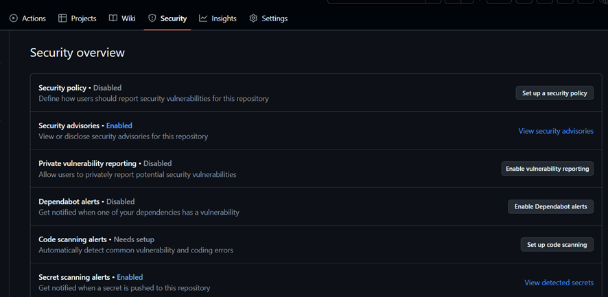

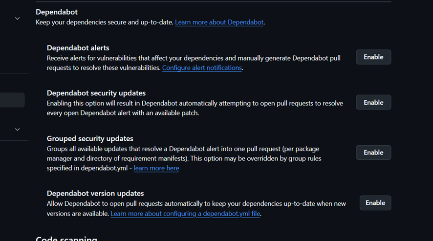

`Para visualizar las Vulnerabilidades de Codigo  tambien se puede consultar desde`


<https://www.youtube.com/watch?v=5V93uJBou7s>  

### - Vulnerabilidades  mostradas y comenta brevemente las vulnerabilidades que consideres que tienen más importancia

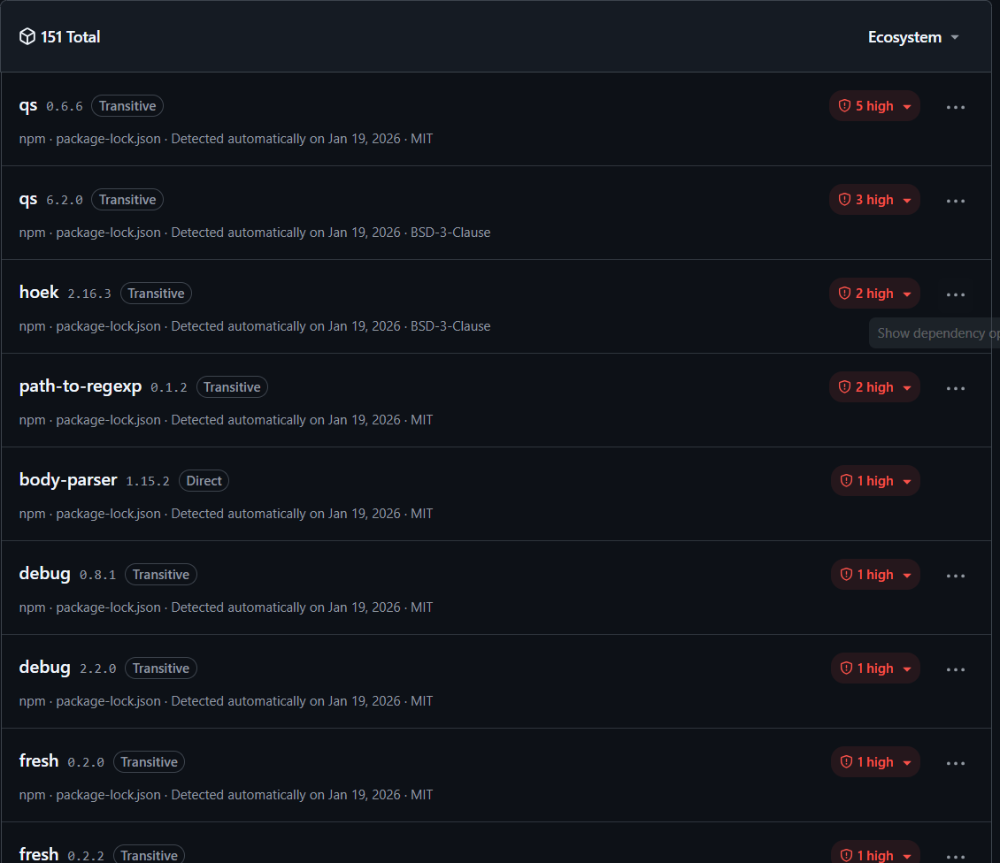

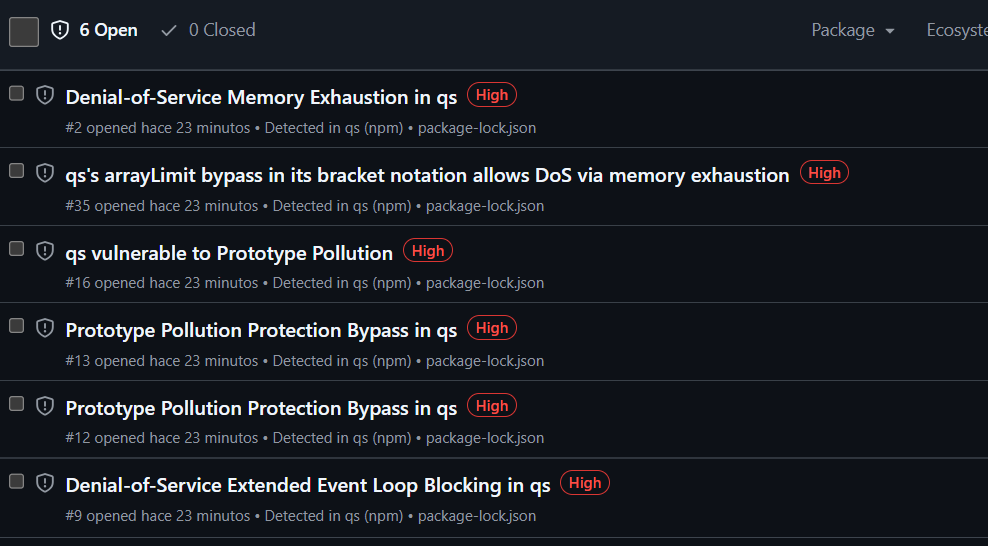

- **Denial-of-Service Memory Exhaustion in qs**
  `Las versiones anteriores a la 1.0 se ven afectadas por una condición de denegación de servicio. Esta condición se activa al analizar una cadena fabricada que se desserializa en arrays muy grandes y dispersos, lo que provoca que el proceso se quede sin memoria y, finalmente, se bloquee .qs .`
  `Actualizando se arreglarian 6 vulnerabilidades relacionadas con la biblioteca qs .`
- **Bump qs from 0.6.6 to 6.14.1 in the npm_and_yarn group across 1 directory**
    `La opción en qs no aplica límites para la notación entre corchetes (), permitiendo a los atacantes causar denegación de servicio por agotamiento de memoria.`
- **Path-to-regexp contains a ReDoS**
  `La expresión regular que es vulnerable al retroceso puede generarse en versiones anteriores a la 0.1.12 de , originalmente reportada en CVE-2024-45296`

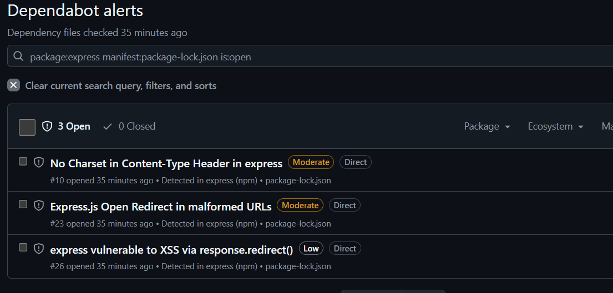

- **Express vulnerable to XSS via response.redirect()**
`En express <4.20.0>, pasar entrada de usuario no confiable —incluso después de sanitizarla— puede ejecutar código no confiable en` **response.redirect()**

- **Realizamos la pull Requests para actualizar las dependencias obsoletas**


## Renovate

### - Instalacion

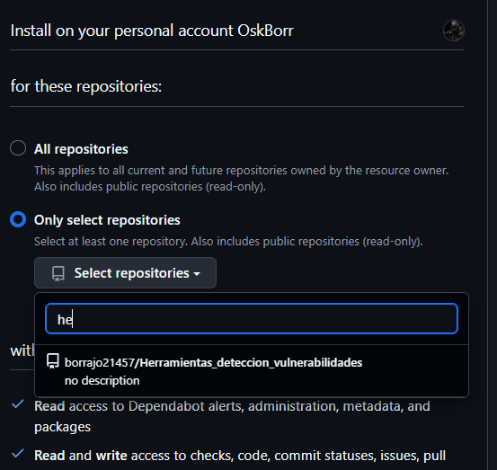

`Debido a que con anterioridad se han actualizado dependencias con Dependabot y que le hemos indicado en la configuracion inicial que cree un Issue cada vez que tenga una actualizacion , debemos de configurar Renovate.`

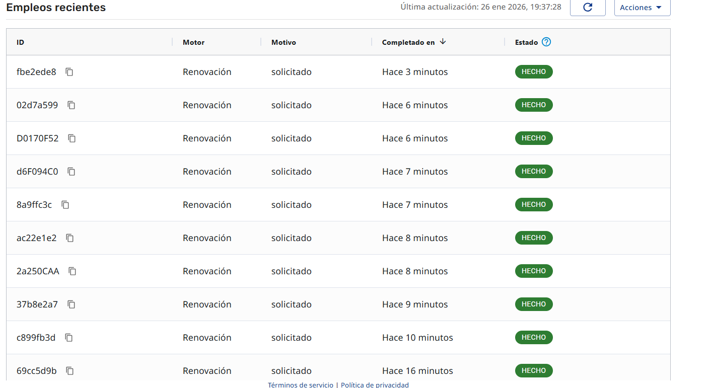

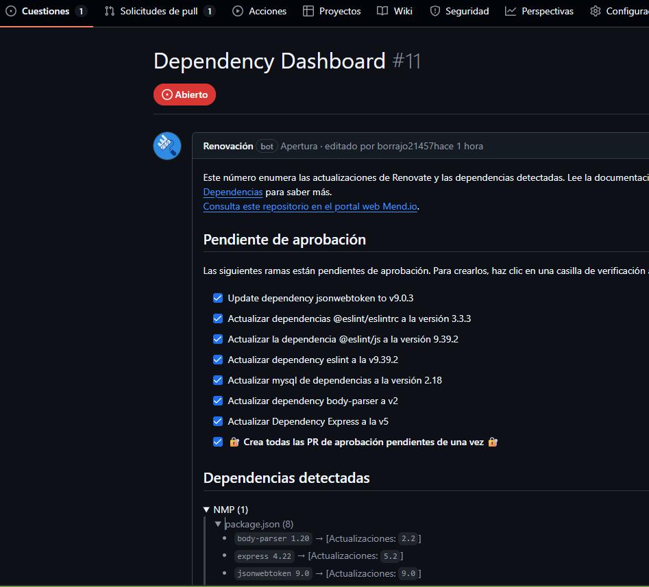

`Se acepta la pull Request  y se realiza el  Merge, esto le concederá permiso a Renovate para actuar y generar PRs del servicio de forma automatica.`

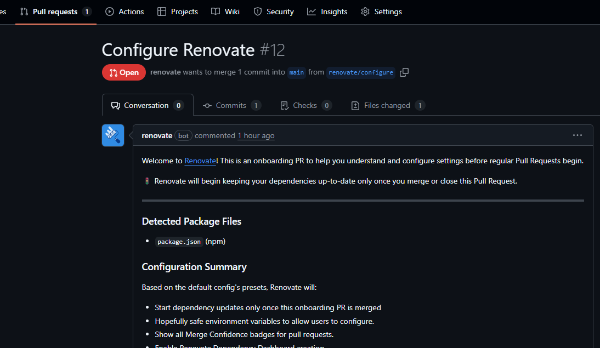

`y actualizamos mas dependencias.`

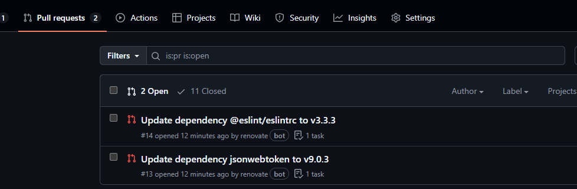
`Renovate es una herramienta automatizada de actualización de dependencias. Ayuda a actualizar dependencias en tu código sin necesidad de hacerlo manualmente. Cuando Renovate se ejecuta en tu repositorio, busca referencias a dependencias (tanto públicas como privadas) y, si hay versiones más recientes disponibles, Renovate puede crear pull requests para actualizar tus versiones automáticamente.`

## eslint

Ejecuta el comando npm run test en el repositorio clonado en tu equipo tras la instalacion de dependencias .

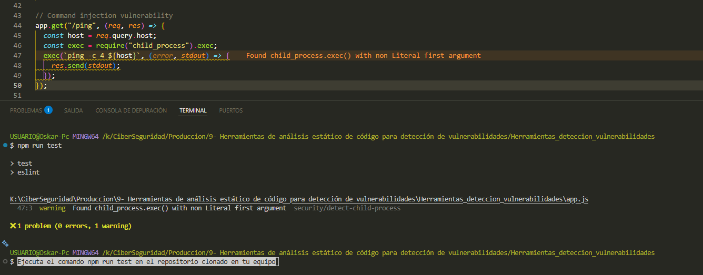

 `El problema es unn` **Command Injection** `ya que la variable` **host** `proviene de`**const host = req.query.host;** `sin validación ni sanitizacion alguna en la cual es posible  interpolar directamente en un comando shell tal como` **ping -c 4 8.8.8.8; rm -rf /**`y borrar todo el servidor`.

## SonarQube

SonarQube es un servicio y una aplicación que realiza análisis estáticos de código buscando vulnerabilidades. Utilizaremos la versión Cloud gratuita que ofrece para repositorios públicos.

Accede a [SonarQube Cloud Login](https://www.sonarsource.com/products/sonarqube/cloud/) e **inicia sesión con GitHub**.
Una vez dentro, crea una nueva organización **seleccionando tu cuenta de usuario de GitHub** para ello.
Concede acceso únicamente a tu **repositorio público con el código de la práctica**.
Selecciona a continuación el plan gratuito y pulsa _Create Organization_:

Selecciona a continuación el repositorio y pulsa _Set Up_:

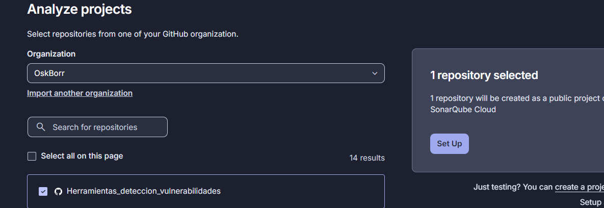

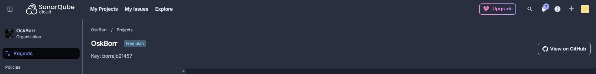

 Selecciona la opción Manual para hacer el escaneo:
 `Actualmente, SonarQube lanza un escaneo automático al crear el proyecto. pero se puede desactivar`

 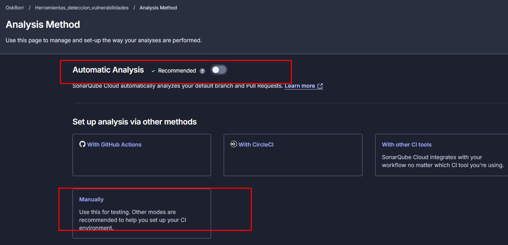

 Sigue las instrucciones según la plataforma que utilices:
 `Pero si lo desactivamos y elegimos el lenguaje en el cual estamos trabajando podemos visualizar la forma de instalacion y el token de acceso`

 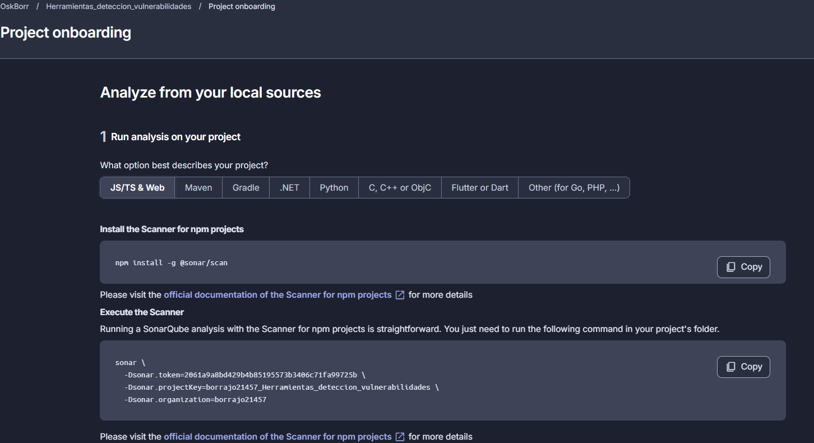

 Variables de entorno, ejecuta este comando en la consola donde vayas a lanzar el programa, antes de la ejecución, sustituyendo **TOKEN_PROPORCIONADO_EN_INSTRUCCIONES** por el token que aparezca en tu pantalla:

 `El análisis se ha ejecutado automáticamente desde SonarCloud tras la vinculación del repositorio, por lo que no ha sido necesario lanzar manualmente el escaneo mediante SonarScanner ni configurar el token en local.`

 ``` {
 npm install -g @sonar/scan

 sonar \
  -Dsonar.token=2061a9a8bd429b4b85195573b3406c71fa99725b \
  -Dsonar.projectKey=borrajo21457_Herramientas_deteccion_vulnerabilidades \
  -Dsonar.organization=borrajo21457
 }
```

 A continuación, ejecuta el código proporcionado en las instrucciones.Haz una captura de los problemas encontrados. Explica brevemente en qué consisten. Estos problemas, ¿están en el código de la aplicación o en alguna librería externa?

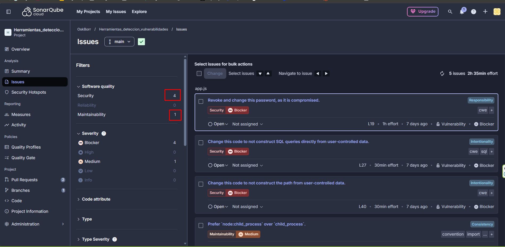
`SonarCloud detecta varios problemas de seguridad .Estos problemas no se encuentran en librerías externas, sino que están directamente en el código de la aplicación, ya que SonarCloud señala líneas concretas de codigo del archivo app.js`

- 1  `Uso de contraseñas comprometidas, la construcción de consultas SQL directamente con datos introducidos por el usuario, la creación de rutas y comandos del sistema a partir de datos no controlados ni sanitizados, lo que puede dar lugar a ataques de inyección SQL.`
- 2 `Path traversal o ejecución de comandos.`
- 3 `node:child_process ya descrito`
- 4 `Atauques de inyeccion de comandos`
  
## npm audit

Ejecuta el comando npm audit en el repositorio clonado en tu equipo. Observa la salida.
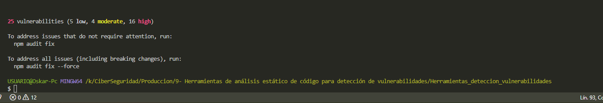

Adjunta una captura de pantalla del resultado y comenta las sugerencias que realiza.
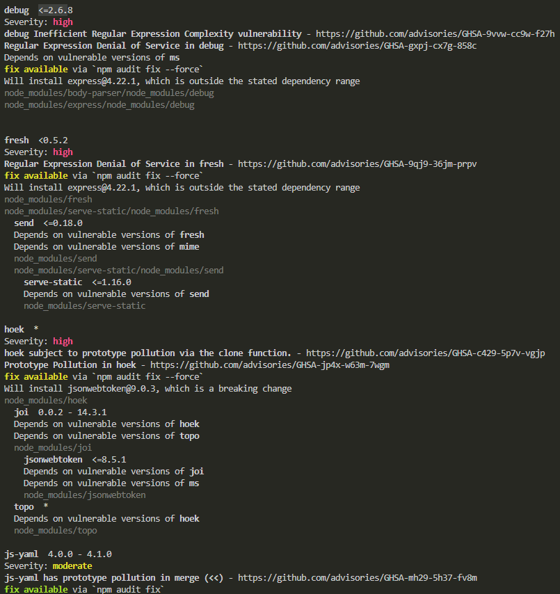
`Al ejecutar  "npm audit", la herramienta analiza las dependencias del proyecto y detecta 25 vulnerabilidades, 16 son de severidad alta, 4 moderadas y 5 bajas. La mayoría de los problemas están relacionados con librerías usadas , como body-parser, express, qs, path-to-regexp, cookie o brace-expansion, que presentan vulnerabilidades conocidas como denegación de servicio (DoS), inyección o problemas de validación de entradas.`
 `npm audit ya sugiere posibles soluciones, indicando en muchos casos que existe una corrección automática mediante los comandos "npm audit fix" o "npm audit fix --force."`

¿Cómo podrías corregir esas vulnerabilidades? Ejecuta el comando correspondiente para hacerlo pero no subas los cambios al repositorio. Haz una captura de pantalla del resultado del comando que corrige las vulnerabilidades. ¿Se han corregido?
`Las vulnerabilidades pueden corregirse actualizando las dependencias afectadas a versiones más recientes y seguras ejecutando el comando "npm audit fix" que aplica automáticamente las correcciones que no suponen cambios importantes en el proyecto. Por lo cual tras aplicar la ejcucion del comando  se baja de 25 vulnerabilidades a  20`

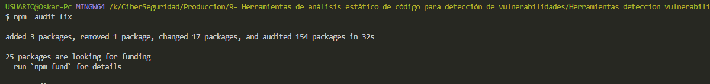
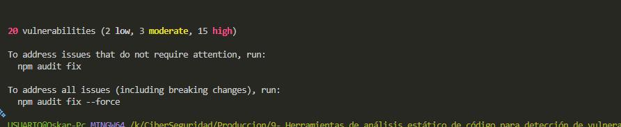

`Al ejecutar "npm audit fix --force", todas las dependencias vulnerables se han actualizado y, al volver a ejecutar npm audit, el resultado indica “found 0 vulnerabilities”, por lo que las vulnerabilidades han quedado completamente corregidas.`

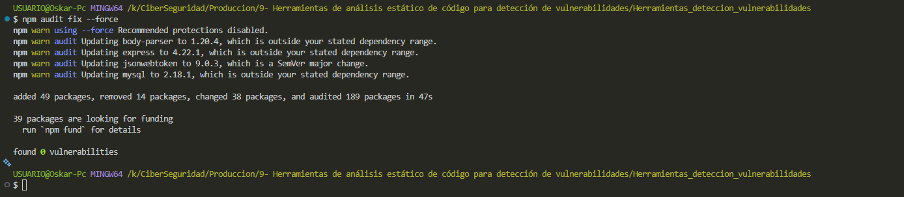

`Si se ejecuta "npm fund" se pueden ver los cambios que se han realizado`

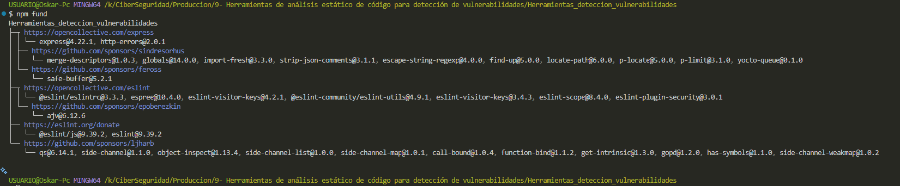

## Preguntas finales

- Si quisieras detectar qué librerías o dependencias son vulnerables en tu proyecto, ¿qué herramientas de las estudiadas utilizarías?
  `Utilizaría Dependabot, Renovate y npm audit por ser herramientas que analizan las dependencias del proyecto y comparan sus versiones con bases de datos de vulnerabilidades conocidas, avisando cuando una librería es insegura y proponiendo actualizaciones a versiones más seguras.`
- Si quisieras detectar vulnerabilidades en el código propio del proyecto, ¿qué herramientas de las estudiadas utilizarías?
`Utilizaría eslint y SonarCloud por ser herramientas que realizan análisis estático del código fuente y permiten detectar malas prácticas, posibles fallos de seguridad y vulnerabilidades como inyecciones, uso inseguro de funciones o errores de validación de datos.`

## [Enlace al repositorio público](https://github.com/borrajo21457/Herramientas_deteccion_vulnerabilidades)
